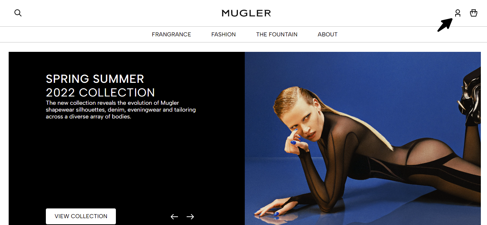
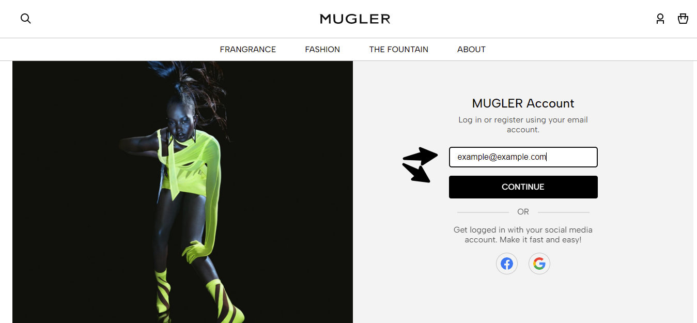
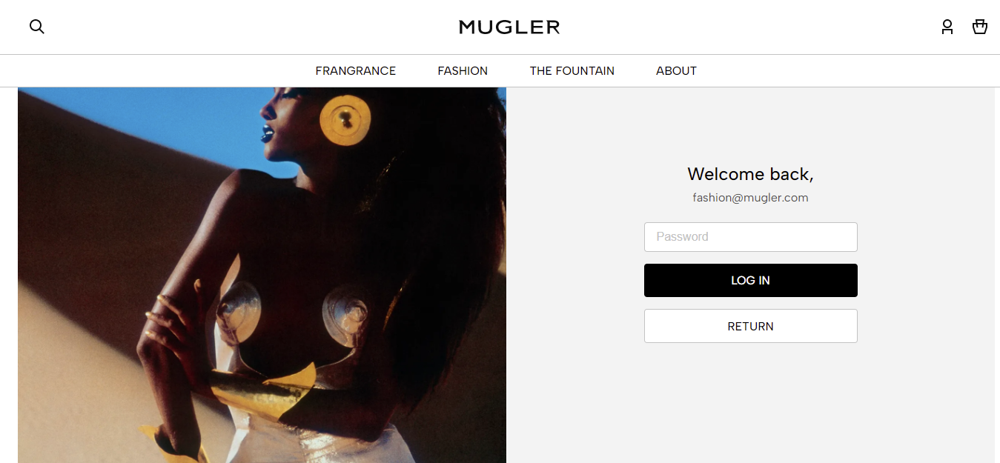
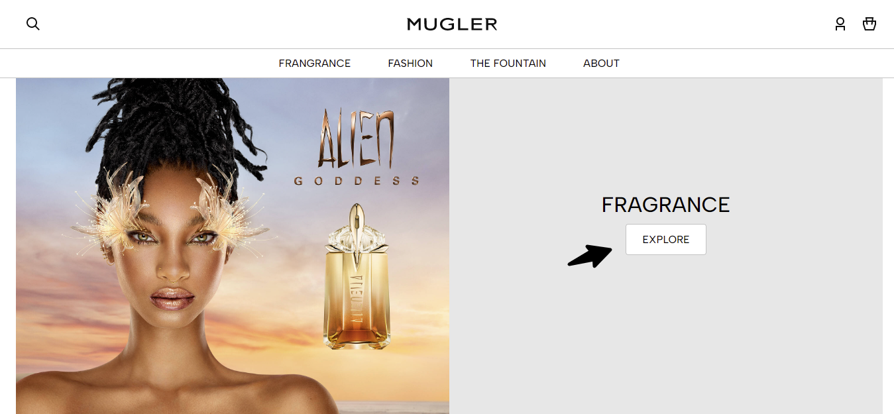
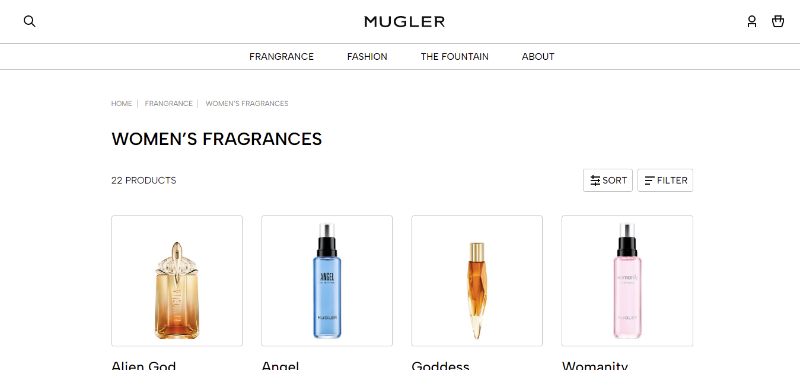

Mugler Website

The Mugler Website project showcases my skills in JavaScript, HTML, and SCSS as I create my own version of the popular clothing brand's website. As a fan of various clothing brands, I've been studying their websites and was inspired to tackle this project. In addition to the main page, I've also created a login/register page where users can enter their email address to proceed to the password entry page. Additionally, there is a page showcasing some of the brand's products. This project allowed me to develop my front-end development skills and create a website that highlights my attention to detail and ability to create a sleek and stylish design.

From the main page, you can reach a page made to present some of the products by pressing the first explore button.

